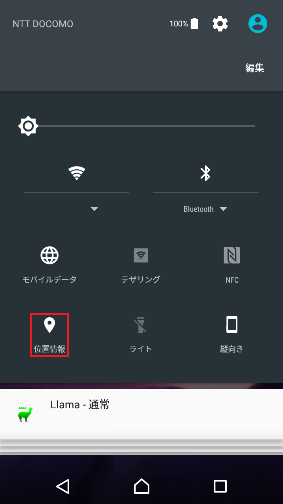
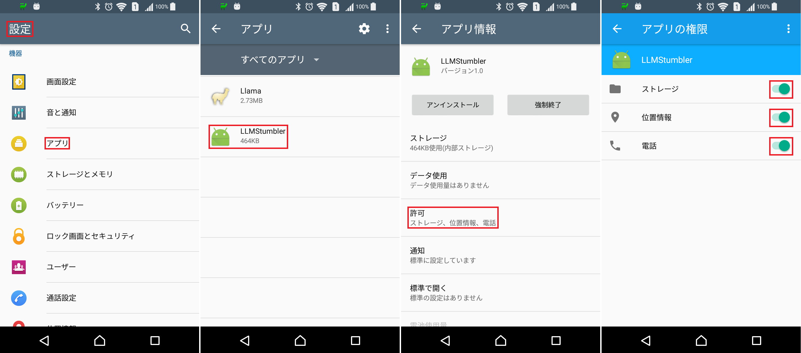

LLMStumbler
====

## Overview
---

Stumbler app for [Llama](https://play.google.com/store/apps/details?id=com.kebab.Llama)

## Install
---

Download the APK package from [github](https://github.com/YA-androidapp/LLMStumbler/blob/master/app/build/outputs/apk/app-debug.apk?raw=true)

## Usage
---

Android 6.0以降の端末をお使いの場合は、端末の位置情報・権限を有効化する必要があります。
参考: [https://firespeed.org/diary.php?diary=kenz-1822](https://firespeed.org/diary.php?diary=kenz-1822)

## Licence
---

[Apache License, 2.0](http://www.apache.org/licenses/LICENSE-2.0)

## Author
---

[YA-androidapp](https://github.com/YA-androidapp)

---

Copyright (c) 2016-2017 YA-androidapp(https://github.com/YA-androidapp) All rights reserved.
